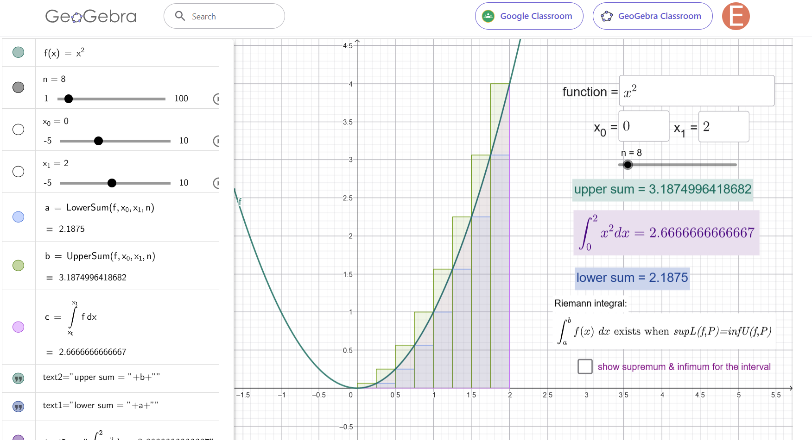
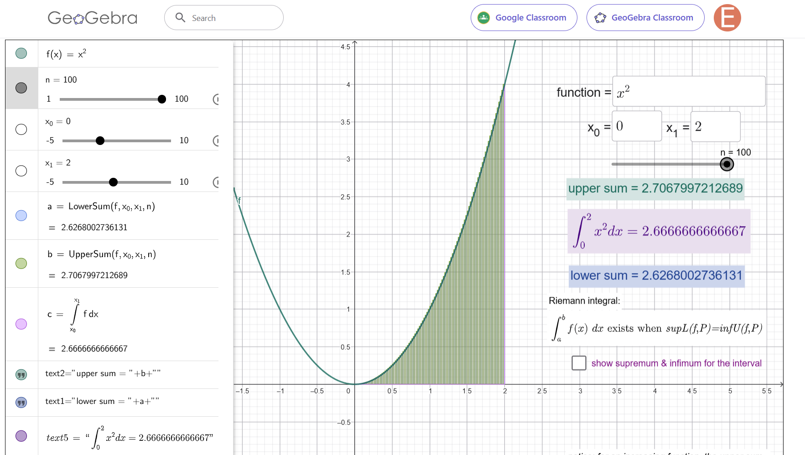
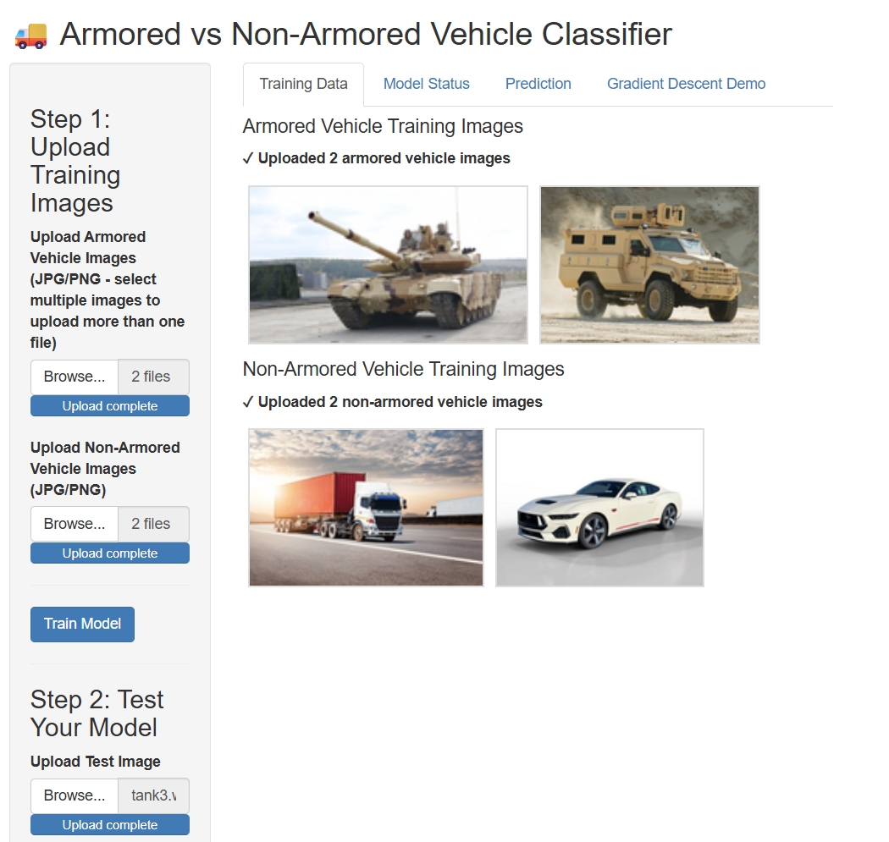
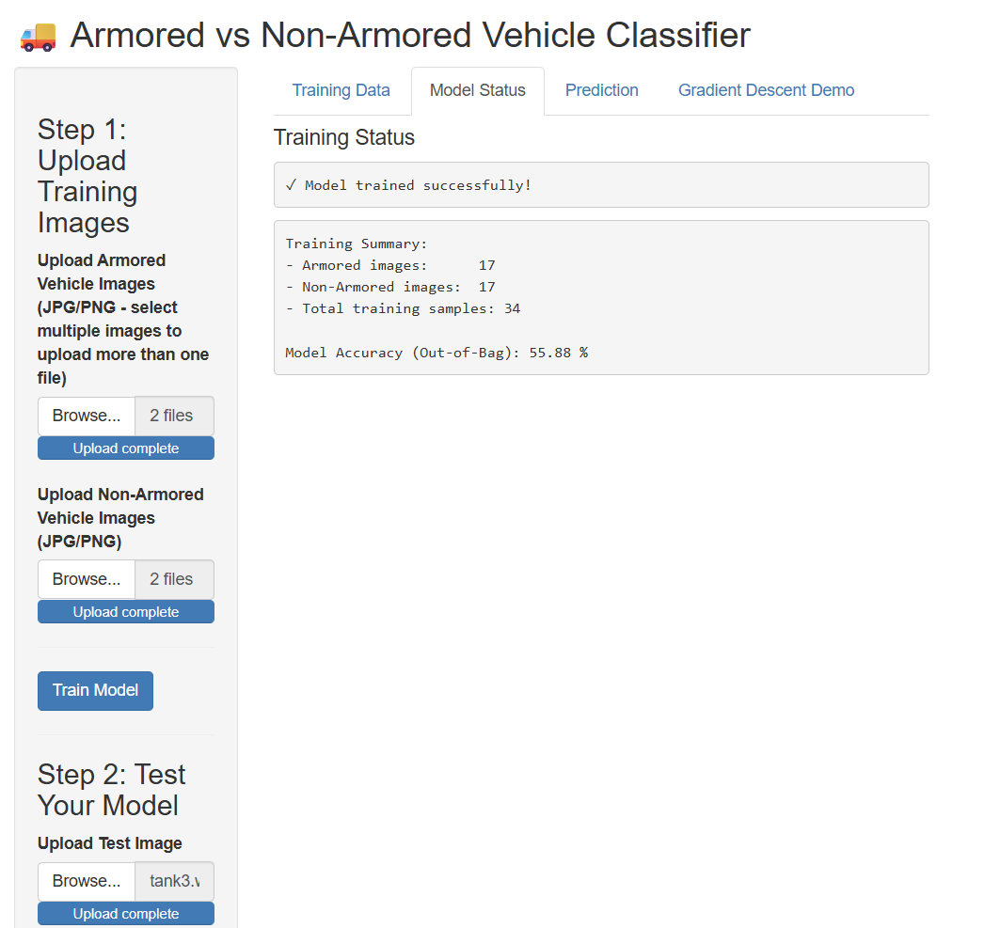
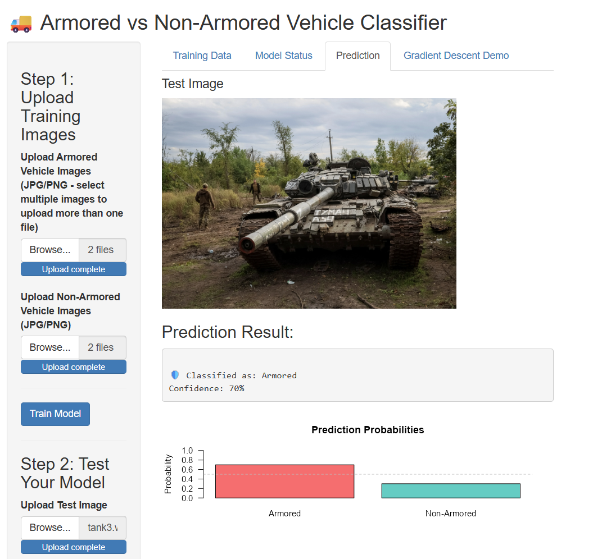
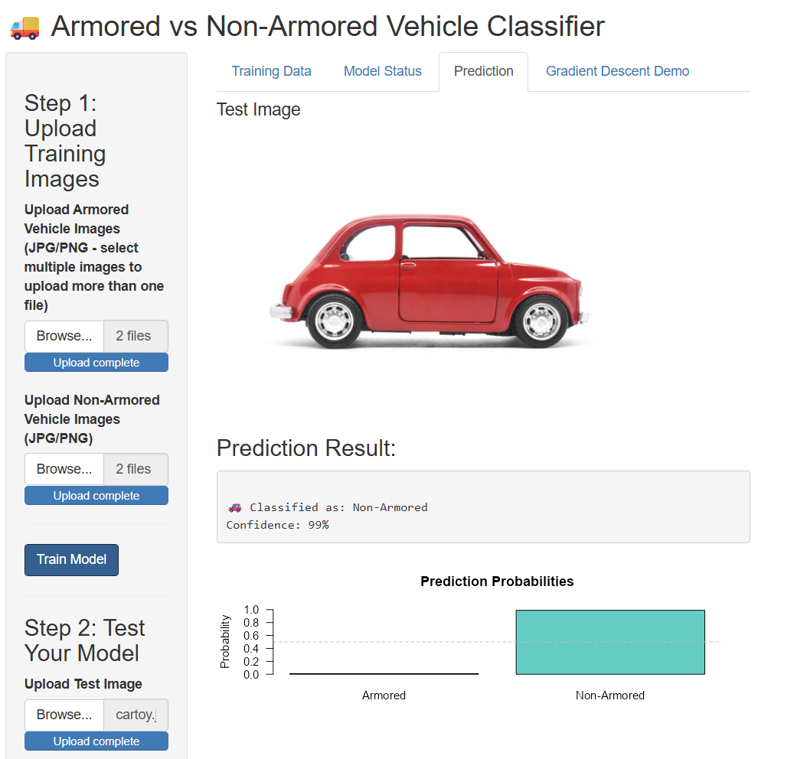
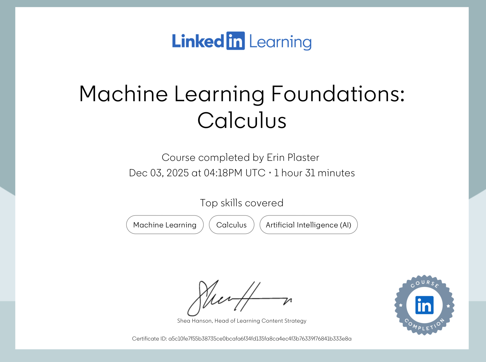

# Advanced Analysis
Erin Plaster
12-07-2025


## Information Architecture

```
advanced-analysis/
├── README.md                          # Project overview and navigation guide
├── data/                              # Datasets used in analysis
│   └── synthetic-data.csv
├── images/                            # Project visualizations and figures
├── notebooks/                         # Jupyter notebooks for analysis
│   └── placeholder.ipynb
├── project7/                          # Mathematical modeling project (Riemann sums)
│   ├── convoy_data_clean.csv
│   ├── project7_python.ipynb         # Python implementation and analysis
│   └── README.md                     # Project-specific documentation
├── reports/                           # Generated analysis reports
├── rstudio/                           # R Shiny applications
│   ├── Classification_Model/          # Image classification (armored vs non-armored)
│   │   ├── app.R                     # Shiny app for vehicle classification
│   │   └── www/                      # Web assets
│   │       ├── armored/              # Sample armored vehicle images
│   │       │   ├── arm1.avif
│   │       │   └── arm11.avif
│   │       └── nonarmored/           # Sample non-armored vehicle images
│   └── Regression_App/                # Fuel consumption prediction model
│       ├── app.R                     # Shiny app for regression predictions
│       └── convoy_data_clean.csv     # Vehicle and fuel data
```

---

## Introduction
My name is Erin Plaster, and I am currently an undergraduate mathematics student at Texas A&M University - Central Texas. My main interests lie in mathematics education, data science, machine learning, and the ongoing development of my understanding in the field of mathematics. Following the completion of my Bachelor of Science in Mathematics, I plan to pursue graduate studies to further specialize in my field. 

## Capstone Project Overview
The two sections submitted for the capstone project illustrate my understanding of mathematical concepts that relate to analytical calculus and data visualization. Project A, focuses on Riemann sums and Riemann integration, an analytical discussion central to calculus and foundational to my mathematics education. Project B explores both an image classifier application using a Shiny application in R and a linear regression model for predicting fuel consumption. These projects demonstrate my theoretical understanding of calculus as well as the mathematical skills required for machine learning. Through this work, I have developed strong problem solving skills and have learned to adapt when difficult questions or scenarios arise, whether working independently or in a collaborative environment. Moreover, I have found that I am deeply interested in how mathematics and machine learning intersect, and look forward to continuing to developing these skills.

## Mathematical Modeling Project 
The purpose of this project is to discuss Riemann sums and show how they can be used to approximate areas, including what conditions must be present for a function to be Riemann integrable. More specifically, the project will look closely at the convergence of upper and lower sums for a continuous function on a closed interval and discuss how integrability is affected when discontinuities or unbounded behavior are present. The project includes a GeoGebra applet to visualize Riemann integration that allows the user to adjust the number of partitions and determine whether a function is Riemann integrable on an interval.

## Link to the Mathematical Modeling Project
https://www.geogebra.org/m/xhp3sqnt

## Selected Visualizations




## Data Analysis and Visualization Project
The goal of this project is to provide junior officers at III Corps with tools that can support situational awareness in the field and tools to assist in predicting logistic needs. This study demonstrates how two different datasets can be transformed through preprocessing, explanatory data analysis, visualization, and predictive modeling to prepare officers for missions. The first analysis develops a Random Forest classifier that distinguishes armored from non-armored vehicles using color based image features. The Shiny web application demonstrates how machine learning can assist in asset detection through the use of image classification, visualization of the model training, and a short (user appropriate) description of gradient descent. The second analysis builds a multivariate linear regression model to predict fuel consumption based on vehicle weight, speed, and distance traveled. The project includes both a Shiny web application and Python code that accepts user input to predict fuel consumption. These models illustrate how automated decision systems could work together to support III Corps.

## Link to the Data Analysis and Visualization Project

## Selected Visualizations





## Certificate of Completion - LinkedIn Learning course Machine Learning Foundations: Calculus
